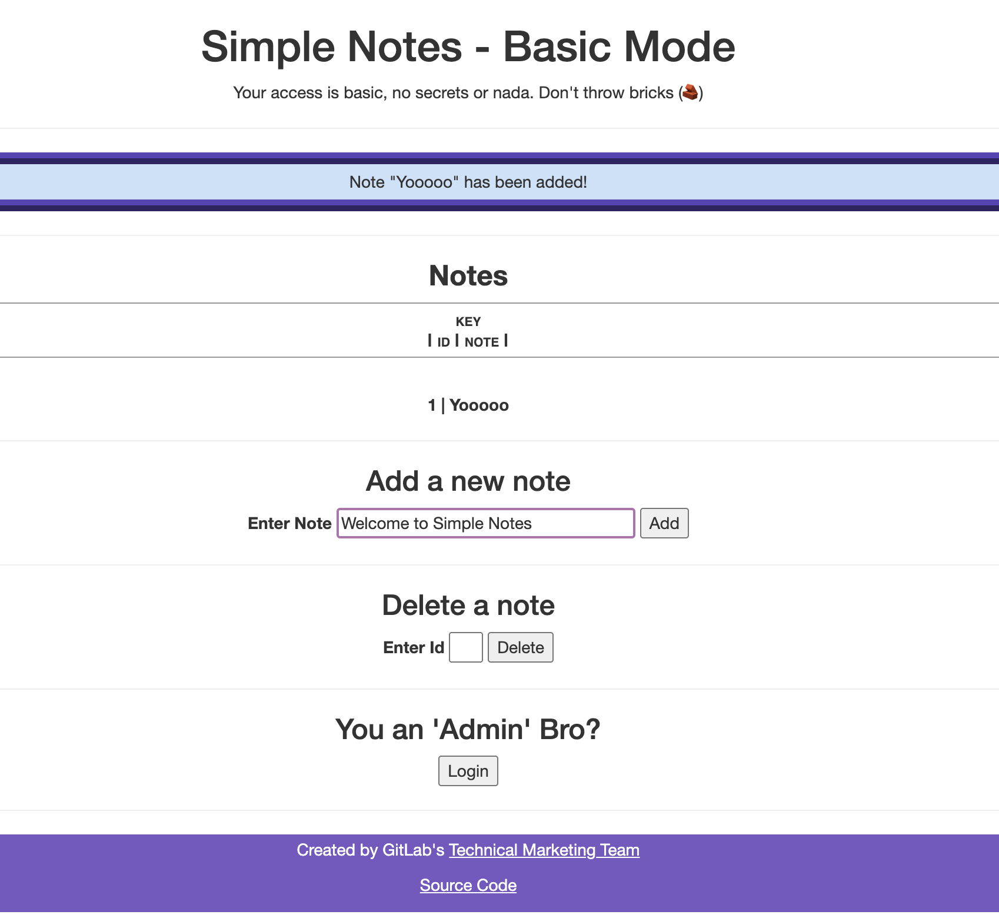

# Simple Notes (Security Demo Application)

This application is used for taking simple notes, like **"Everyone needs to go ahead and come in on Saturday and Sunday to help out with the new code push."** It is used to demo many of GitLab's Security features.

Be sure to ead the documentation within the [Simple Notes Documentation](https://tech-marketing.gitlab.io/devsecops/initech/simple-notes/) which contains Architecture, Development Guide, Instructions on Creating Vulnerability, and much more.

**Note: Do not edit this project directly, but rather clone it and configure it within your own GitLab instance.**

---

# Deploying on Public GitLab

This project is meant to be used within your GitLab instance so that you can view the pipelines, create MRs with security vulnerabilities and much more. To start you can view this YouTube video I have created:

`COMING SOON!`

## Step 1: Copy Project into Workspace

1. Make sure you are using [GitLab Ultimate](https://about.gitlab.com/pricing/ultimate/) and logged in  
**Note: You can signup for a [30 day trial](https://gitlab.com/-/trials/new?utm_medium=cpc&utm_source=google&utm_campaign=brand_amer_pr_rsa_br_exact_&utm_content=free-trial_digital_x-pr_english_&_bt=624524579996&_bk=gitlab%20trial&_bm=e&_bn=g&_bg=142303748075)**

2. Create a new GitLab project

3. Select `Import project`

4. Select `Repository by URL`

5. Add `https://gitlab.com/tech-marketing/devsecops/initech/simple-notes.git` as the Git repository URL

6. Under `Project URL`, select a group or namespace where you want to create this project  
**Note:** It can be your GitLab username

7. Select `Public` as the visibility level
**Note:** This is so we don't need to create a token to access our container registry from
our Kubernetes deployment

8. Press the `Create project` button  
**Note:** Project will be created in a few seconds

## Step 2: Configure Kubernetes Agent

In this section, we will connect our GitLab project to Kubernetes using the GitLab Kubernetes agent. By doing this, it will allow us to run `kubectl` and `helm` commands from within the CI/CD pipeline.  

**Note: A Kubernetes Cluster is required. I am using a [GKE](https://cloud.google.com/kubernetes-engine) cluster**

1. Click on the **Infrastructure > Kubernetes clusters** in the left navigation menu

2. Click on the **Connect a cluster (agent)** button

3. Select the `simplenotes` agent from the drop down and press the **Register** button  

**Note:** Save the commands presented to you in the next screen

4. Open a terminal and connect to your cluster

```bash
$ gcloud container clusters get-credentials fern-initech --zone us-central1-c --project fdiaz-02874dfa

Fetching cluster endpoint and auth data.
kubeconfig entry generated for fern-initech.
```

5. Run the following command to deploy the agent onto your cluster:

```bash
$ helm repo add gitlab https://charts.gitlab.io
$ helm repo update
$ helm upgrade --install simplenotes gitlab/gitlab-agent \
    --namespace gitlab-agent \
    --create-namespace \
    --set image.tag=v15.5.1 \
    --set config.token=1gqUgdbmxNsY3pyWLz_HzsqF_8zMgheniaxoCfFx1zPnyWacUQ \
    --set config.kasAddress=wss://kas.gitlab.com
```  

**Note:** Make sure you use the token provided to you

6. Verify the Kubernetes Agent is running

```bash
$ kubectl get pods -n gitlab-agent
```

## Step 3: Run Pipeline and Verify

Now we will go ahead and run a pipeline to get everything deployed and run.

1. Click on `CI/CD > Pipelines`

2. Click on the `Run pipeline` button

3. Leave the default settings

4. Click on the `Run pipeline` button

5. Wait for the pipeline to complete  
**Note: This will take a few mins, so go grab a coffee/tea!**

6. Make sure all the jobs have completed successfully  

7. Click on the `deploy-staging` job

8. Go to the end of the job output

9. Copy the URL listed in the `Access your application at http://$INGRESS_LB_IP/notes` line.

10. Paste URL into your browser, you should see something like the below:



## Step 4: Add Vulnerabilities to test scanners

You can add some vulnerabilities, that way you can see GitLab DevSecOps in action.
For advanced details see this projects [documentation page](https://tech-marketing.gitlab.io/devsecops/initech/simple-notes/getting_started/developer_workflow/).

1. Click on the `Web IDE` button

2. Add changes to files as seen in [this MR](https://gitlab.com/tech-marketing/devsecops/initech/simple-notes/-/merge_requests/7)

3. Press the `Create commit...` button

4. Add a commit message

5. Select the `Create a new branch` radio button

6. Check `Start a new merge request`

7. Press the `commit` button

8. Provide information for the merge request

9. Press the `Create merge request` button

10. Wait for the pipeline to finish

11. Vew the scan results within the merge request

---

# Resources

* [Local Development]()
* [Deploying without GitLab]()