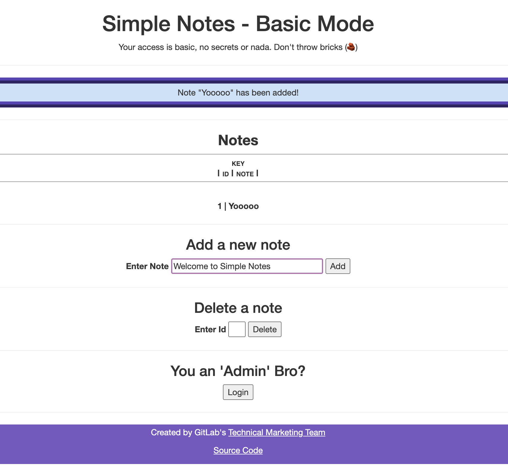

# Simple Notes (Security Demo Application) 🔒🔑

**Note: Do not edit this project directly, but rather clone it and configure it within your own GitLab instance.**

---

This application is used for taking simple notes. It has been created to showcase many of GitLab's Security features and provide a tutorial on how
to use them. Some notable security features covered include:

- Static Security Scanners
- Dynamic Security Scanners
- Security Guardrails/Policies
- Vulnerability Management

Get started by viewing the [**Simple Notes Documentation**](https://tech-marketing.gitlab.io/gitlab-devsecops-tutorial/simple-notes).

If there is something you wanna see featured in this application, please open an issue! MRs are welcome too 😁

---

## Tutorial / Lessons

You can get started using this project on your own GitLab account with the following lessons:

- Lesson 1: [DevSecOps Overview](https://gitlab.com/gl-demo-ultimate-hugoazevedo/devsecops-tutorial/simple-notes/-/blob/main/docs/content/getting_started/lesson_1_devsecops_overview/_index.md)
- Lesson 2: [Tutorial Prerequisites](https://gitlab.com/gl-demo-ultimate-hugoazevedo/devsecops-tutorial/simple-notes/-/blob/main/docs/content/getting_started/lesson_2_tutorial_prerequisites/_index.md)
- Lesson 3: [Deploying the Demo Application](https://gitlab.com/gl-demo-ultimate-hugoazevedo/devsecops-tutorial/simple-notes/-/blob/main/docs/content/getting_started/lesson_3_deploying_the_demo_application/_index.md)
- Lesson 4: [Setting up and Configuring Security Scanners and Guardrails](https://gitlab.com/gl-demo-ultimate-hugoazevedo/devsecops-tutorial/simple-notes/-/blob/main/docs/content/getting_started/lesson_4_setting_up_and_configuring_the_security_scanners_and_policies/_index.md)
- Lesson 5: [Developer Workflow](https://gitlab.com/gl-demo-ultimate-hugoazevedo/devsecops-tutorial/simple-notes/-/blob/main/docs/content/getting_started/lesson_5_developer_workflow/_index.md)
- Lesson 6: [AppSec Workflow](https://gitlab.com/gl-demo-ultimate-hugoazevedo/devsecops-tutorial/simple-notes/-/blob/main/docs/content/getting_started/lesson_6_appsec_workflow/_index.md)
- Lesson 7 **Bonus**: [Policy as code with GitOps](https://gitlab.com/gl-demo-ultimate-hugoazevedo/devsecops-tutorial/simple-notes/-/blob/main/docs/content/getting_started/lesson_7_policy_as_code_gitops/_index.md)

---

## Useful Resources

- [GitLab Ultimate Pricing Page](https://about.gitlab.com/pricing/ultimate/)
- [DevOps Solution Resource - DevSecOps](https://about.gitlab.com/handbook/marketing/strategic-marketing/usecase-gtm/devsecops/)
- [What is DevSecOps?](https://about.gitlab.com/topics/devsecops/)
- [Integrating Security into your DevOps workflow](https://about.gitlab.com/solutions/dev-sec-ops/)
- [GitLab Secure Direction Page](https://about.gitlab.com/direction/secure/)
- [GitLab Govern Direction Page](https://about.gitlab.com/direction/govern/)

---

Created and maintained by [Fern](https://gitlab.com/fjdiaz)🌿

- [LinkedIn](https://www.linkedin.com/in/awkwardferny/)
- [Twitter](https://twitter.com/awkwardferny)
